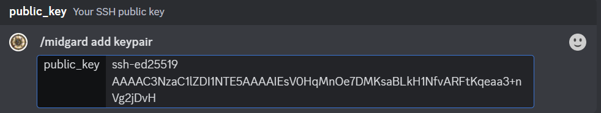

# Key Pairs

In Midgard, a public-private keypair is used instead of a password to log on to any Virtual Machine (VM) you launch. A keypair consists of two files: a private key and a public key, which belong to each other like a lock and key. The private key file should be securely stored on your computer in a location that only you can access. The public key can be used to authorise and authenticate you in a remote computer account.

When you launch an instance in Midgard, the public key from your Midgard account is placed into your VM, so that you can use SSH to connect to your VM using the following essential connection elements:

- The cloudflare hostname of the instance
- The image user account (e.g. `ubuntu`)
- The private key that is securely stored on your computer

## Creating a Key Pair

To create a keypair, you can use the default settings for `ssh-keygen` with the ed25519 algorithm. Here are the steps to create a keypair:

1. Open a terminal window and type the following command: `ssh-keygen -t ed25519`
2. Press Enter to accept the default filename and location for the keypair files.
3. Enter a passphrase for your private key. You can leave this blank, but it is not recommended.
4. Confirm the passphrase.

After completing these steps, you will have two files: a private key (`~/.ssh/id_ed25519`) and a public key (`~/.ssh/id_ed25519.pub`). Make sure to store the private key in a safe location on your computer.

## Adding a Key Pair

To add a keypair in Midgard using your existing public key, you can use the `/midgard add keypair` command in Discord. Here are the steps to add a keypair using this command:

1. Open Discord and go to the VAIT server.
2. Type the following command in the #midgard-commands channel: `/midgard add keypair publickey:<your_ssh_key>`, where `<your_ssh_key>` is the content of your SSH public key file (which is the contents of `~/.ssh/id_ed25519.pub`).
3. Press Enter to execute the command.
<figure markdown>
  
  <figcaption>Example add keypair command in Discord</figcaption>
</figure>
After completing these steps, your keypair will be added to Midgard and you can use it to launch instances.

## Updating a Key Pair

To update a keypair in Midgard, you can follow these steps:

1. Create a new keypair by following the steps in the "Creating a Key Pair" section.
2. Use the `/midgard add keypair` command to add the new public key to Midgard.
3. Relaunch your instance and specify the new keypair when launching the instance.

Note that the existing key on the instance is not replaced, and you will need to relaunch the instance to use the new keypair. Think of it like replacing a house key - if you're locked outside, you can't just replace the key, you will need to replace the lock as well.
