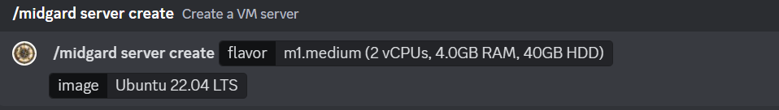

# Launching a VM

To launch a VM in Midgard Cloud, you can use the `/midgard server create` command in Discord. Here are the steps to launch a VM using this command:

1. Make sure you have the `cloudflared` binary installed on your computer. You can download it from the official [Cloudflare website](https://developers.cloudflare.com/cloudflare-one/connections/connect-apps/install-and-setup/installation).
2. Open Discord and go to the Midgard server.
3. Type the following command in the #bot-commands channel: `/midgard server create flavor:m1.small image:Ubuntu 22.04`
4. Press Enter to execute the command.
<figure markdown>
  
  <figcaption>Example create command in Discord</figcaption>
</figure>
This command will launch a VM with the following specifications:

- Flavor: m1.small (1 vCPUs, 2.0GB RAM, 20GB HDD)
- Image: Ubuntu 22.04

Other flavor options are available:

- m1.small (1 vCPUs, 2.0GB RAM, 20GB HDD)
- m1.medium (2 vCPUs, 4.0GB RAM, 40GB HDD)

Other image options are available:

- CentOS 7
- Ubuntu 22.04 LTS

After completing these steps, your VM will be launched in Midgard Cloud and you can use SSH to connect to it using the public key you added to your Midgard account. Remember to specify the new keypair when launching the instance if you updated your keypair.

## Accessing the VM

To access your server, add the following to your `~/.ssh/config` file:
```ssh-config
Host midgard
HostName {hostname}
User {image_default_user}
ProxyCommand /usr/local/bin/cloudflared access ssh --hostname {hostname}
```

Replace `{hostname}` with the Cloudflare hostname of your VM and `{image_default_user}` with the default image user account for your image (e.g. `ubuntu` for Ubuntu images). Then you can access your server by running `ssh midgard`. The create command will give you the exact parameters.
